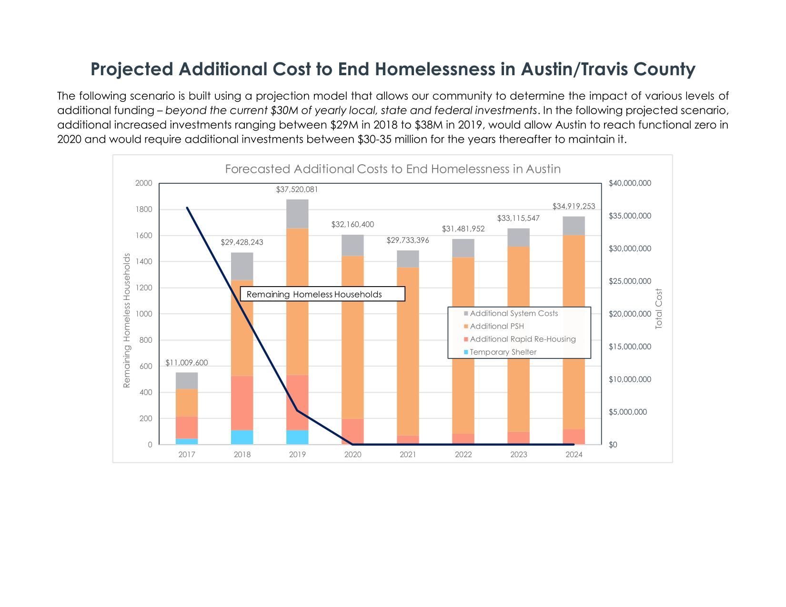
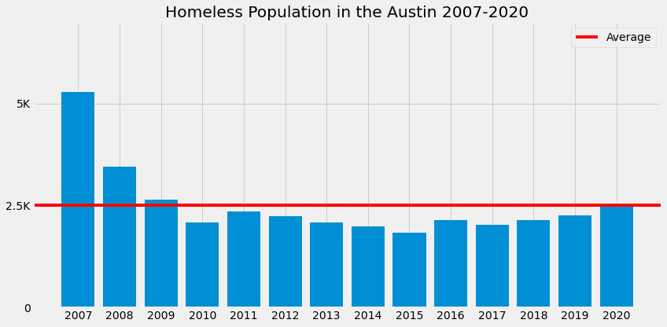
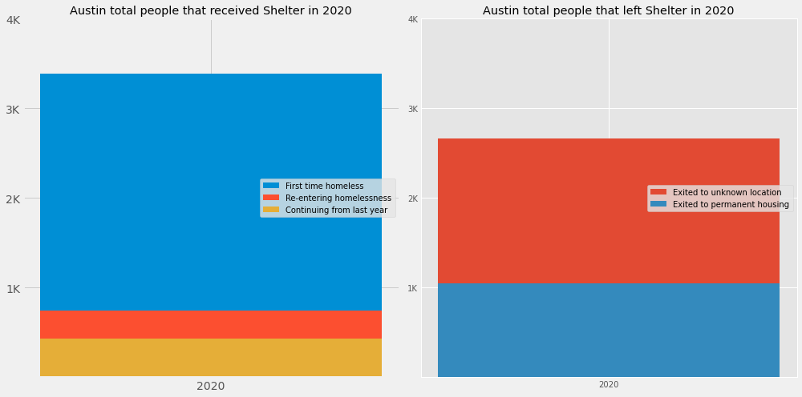
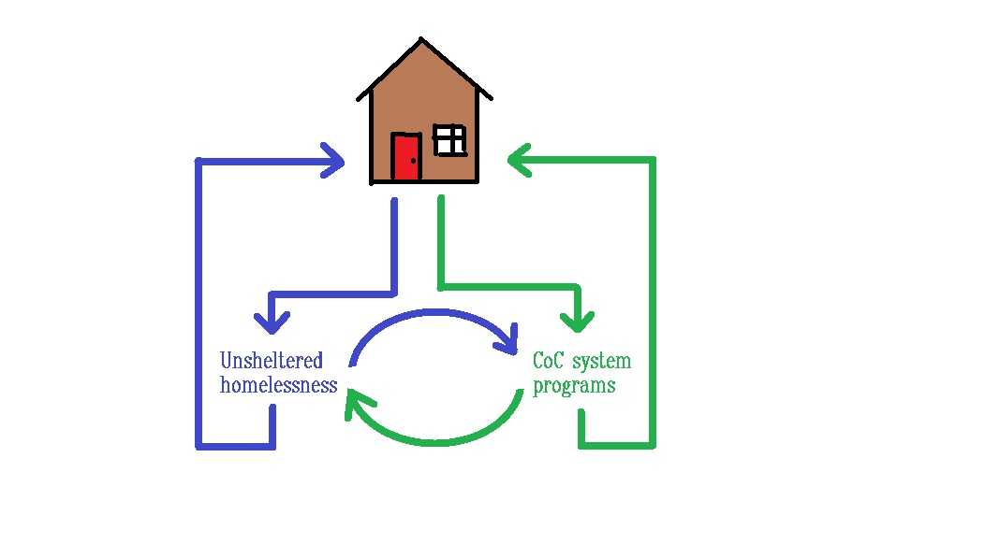
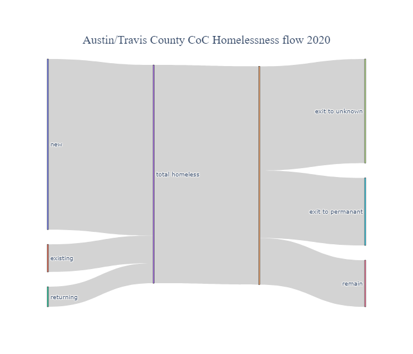

# RETHINKING HOMELESS METRICS

### The Situation:
---

In 2018 the city partnered with Austin homelessness agency ECHO (Ending Community Homelessness Coalition) to produce the [Ausitn's Action Plan To End Homelessness](https://1zdndu3n3nla353ymc1h6x58-wpengine.netdna-ssl.com/wp-content/uploads/2019/07/Austin%E2%80%99s-Action-Plan-to-End-Homelessness-%E2%80%93-Working-Document.pdf) report. This report laid out a 5 part plan to put an end to homelessness and then even put forward this chart showing the estimated cost requirement over time to achieve a net zero end to homelessness in Austin.

Under this action plan, the solution is a straightforward investment to provide and maintain enough beds, and homelessness is defeated. However, as we can see below, from 2017 til now, Austin has allocated a considerable amount of money towards this end but homelessness has clearly not been ended. 

### The Problem:
---

The city of Austin currently measures its homeless population and its performance in addressing homelessness using a handfull of metrics that paint the homeless as a relatively static population that simply needs to be housed to end homelessness. Here are a few of the current dashboards in use:

- [City strategic performance measures](https://data.austintexas.gov/stories/s/Health/iane-nkjw/)
- [Austin ECHO measures](https://www.austinecho.org/about-echo/homelessness-in-austin/)
- [Imagine Austin Indicators](https://data.austintexas.gov/stories/s/Household-Affordability/czit-acu8)
- [Homeless Response System Performance Dashboard](https://www.austinecho.org/wp-content/uploads/2021/10/AustinCoCDashboardPhase3_20211011_update.html#annual-enrollment)

This is the Point-In-Time count for Austin since 2007.

Looking into the data collected by the homelessness Continuum of Care (CoC) providers and organized into a federally operated database called the Homeless Management Information System (HMIS), I discovered that the homeless population is not static at all, but actually quite dynamic. In 2020, around 70% of the people that recieved assistance from a CoC facility in Austin were experiencing homelessness for the first time, and about 75% of the people that received assistance moved into either permanent housing or to an unknown location. 

The current metrics do not convey this aspect of the homelessness problem, so the progams put in place to address homelessness are based on an incomplete understanding of the issue.

### The Solution:
---

If we visualize homelessness as a dynamic flow, we can gain insight into how to combat it and how to measure the results of our efforts. Below is a diagram of how we can think about the flow of indivuals through homelessness.      

While the flow of the unsheltered homeless population is currently very difficult to accurately measure, there are already CoC measurements in place to build a diagram that captures the flow of the sheltered homeless population. Using the [CoC System Performance Measures](https://www.hudexchange.info/resource/5793/national-summary-system-performance-measures-2015-2017/) data, I created a visualization of Austin homelessness in 2020 that presents a more complete picture of CoC performance than the dashboard visualizations currently in use.

From this chart it is readily apparent that programs to understand and prevent homelessness would have huge impact on overall homeless reduction. This chart compiled on a monthly or quarterly basis could give insights into seasonal patterns. Annual chart comparisons would show at a glance the effects of current programs on different areas of the homelessness cycle. 

